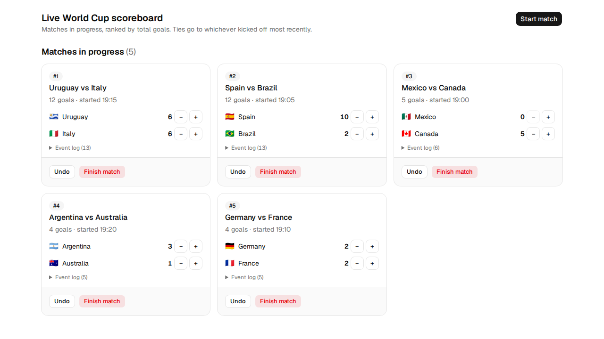

# Live Football World Cup Scoreboard

A React + TypeScript scoreboard for an operator monitoring several live World Cup matches at once. Built for the Sportradar Data & Odds Platform coding exercise.



That screenshot is the brief's example scenario. It is generated by the end-to-end test that drives the scenario through the UI, so it cannot drift from what the app actually does.

## Running it

Needs Node 20.19+ or 22.12+ (what Vite 8 requires; developed on Node 24).

```bash
npm install
npm run dev            # dev server on http://127.0.0.1:5173
npm run build          # type-check and build to dist/
npm run preview        # serve the production build
npm run lint
npm test               # 141 unit, component and integration tests
npm run test:coverage
```

End-to-end tests are optional per the brief, so I kept them out of `npm test` — a fresh clone should never fail on a missing browser download:

```bash
npx playwright install
npm run test:e2e       # 6 tests: 3 flows on desktop Chrome and a Pixel 5
```

## What it does

Start a match from a fixed team list, adjust either side's score, finish it, and read a summary of everything still in progress — ranked by total goals, with the most recently started match winning a tie.

- **Additional operation (§5):** undo the last score change.
- **Chosen feature (its own commit):** a per-match event log.

## Assumptions

- **"Start" means registration.** The operator registers a match that is already kicking off; I don't model a scheduled kickoff. Registration order is what "most recently started" means.
- **A team plays one match at a time.** This also blocks starting the same fixture twice, so I didn't write a separate rule for it. Finished matches release their teams.
- **Scores change one goal at a time.** Two buttons per side, not a number input.
- **Finishing is final.** A finished match can't be scored, edited or undone.
- **Roughly a matchday's worth of matches.** Six or so, not hundreds — no virtualisation, no pagination, no retention policy.
- **Teams come from a fixed list.** All ten from the brief's example are there, so the documented ordering can be reproduced by hand.

## Decisions worth explaining

**Ordering is a pure function over a monotonic sequence, not a timestamp.** `Date.now()` collides within a millisecond, and once state has been through localStorage the original insertion order is gone, so sort stability can't rescue it. Each match gets a registration number instead. The wall-clock time is stored for display only. This also answers the obvious follow-up question — equal goals _and_ equal start time isn't a state the app can reach.

**The summary is a grid to look at and a list in the markup.** A grid is what an operator watching six matches wants; a `<ol>` is what carries the ranking to anyone not looking at the screen. Every card shows its own position, total goals and kickoff time, so the ordering rule can be checked on sight rather than inferred from layout.

**Cards animate when the ranking changes.** Without it the board teleports and the card you were aiming at is replaced under the cursor. The animation alone doesn't fix that, since the target is still moving, so the list stops accepting pointer events for the ~180ms cards are in flight. A swallowed click costs a second click; a mis-click records a goal against the wrong team.

`−1` **and undo are not the same thing.** `−1` says the score is genuinely lower — a goal disallowed, overturned, or given to the wrong side. Undo says the previous entry was a data-entry mistake. Identical arithmetic, different claim about what happened, and the event log records them as different things.

**zustand, justified honestly.** Not for performance — nothing in this app ticks, so renders only happen when the operator clicks, and at six matches a context would be indistinguishable. I used it for the persistence middleware, for a store I can test without React, and because the board can subscribe to the ranked list of ids while each card subscribes to its own match.

## The additional operation: undo

One step, per match, and it disarms itself. The brief says "undo last score change", singular, and one step is what correcting a mis-click actually needs. It reverts a goal or a goal removal, never a finish, and it appears in the event log rather than quietly rewriting it.

## The feature: per-match event log

Every match keeps a record of what happened to it — started, each goal, each goal removed, each undo with the entry it reverted, and the finish — with a timestamp and the score that resulted. It is collapsed by default so the board stays scannable, and a finished match keeps its log.

**Why this one.** The score tells you where a match stands but nothing about how it got there, and this app has two arithmetically identical ways to take a goal off the board. Without a record there is no way to tell "that goal didn't count" from "I fat-fingered that" after the fact, which is exactly what someone reconciling a disputed scoreline needs. It also makes the undo/`−1` distinction above real rather than something I merely assert in this file.

Undo appends to the log and never deletes from it. Removing the mistaken entry would leave a record indistinguishable from one where the mistake never happened.

## Accessibility

Semantic HTML first: the summaries are ordered lists, each card has a real heading, the collapsible sections are `<details>`, and dialogs come from Radix so focus is trapped and returned. Every control has a real accessible name, both team pickers have associated labels, and the score is readable text rather than something inferred from the buttons beside it.

One polite live region for the whole board announces the most recent change. Six — one per card — would interrupt each other every time any match scored. Finishing a match removes its card, so focus moves to the summary heading rather than being dropped on the document body.

**Compromises I accepted:**

- `−` **uses the real** `disabled` **attribute at zero**, which takes it out of the tab order. `aria-disabled` would keep it focusable and is arguably better, but it needs manual click suppression and some way to explain why nothing happened.
- **Flag emoji don't render on Windows Chrome**, which shows the underlying letter pair ("AR", "BR") instead. It degrades to a readable abbreviation, so I kept them. They are decorative and `aria-hidden` everywhere — the team name is always the real label, because screen readers announce regional-indicator pairs inconsistently.
- **Event log entries are told apart by wording, not colour or icon.** The marker glyph is hidden from assistive technology.

`prefers-reduced-motion` is respected in two places: the re-order checks it directly, and a global rule collapses the component library's dialog and card animations, which don't consult it on their own.

## Data

In-memory state persisted to `localStorage` under `srad-scoreboard`, which the brief allows if documented. An accidental refresh shouldn't cost an operator their board.

Rehydration is guarded rather than trusted. Anything that fails to parse or fails validation is discarded and the app starts empty — a stale or truncated value would otherwise rehydrate into a shape the UI doesn't expect, and the operator would get a blank screen on every reload with no way to clear it. Storage _access_ is guarded too, since `localStorage` throws outright in a private window, and a failed write is swallowed so the board keeps working in memory and merely stops surviving a reload.

The stored shape is versioned (currently 3) and each bump ships a migration, so reloading into a new build mid-matchday doesn't drop the board.

## Testing

141 tests under Vitest and React Testing Library, plus 6 Playwright tests.

- The ordering rule is tested directly, including the brief's example scenario and the case where matches arrive in a different order after a reload.
- Component tests query by role and accessible name, so they double as evidence for the accessibility claims above.
- The three end-to-end flows are the ones unit tests can't stand in for: the example scenario through real clicks, a finished match leaving the summary, and state surviving a page reload.

I also periodically re-ran the suite against deliberately broken code to check the tests actually fail when they should, and verified in a real browser the things jsdom can't show — that the animation runs, that it stops under reduced motion, and that Chromium's accessibility tree agrees with the test polyfill.

## Trade-offs and known limitations

- **No retention policy.** Finished matches and their logs accumulate. Fine for a matchday; I left it rather than adding a "clear finished" control, which would blur the "exactly one additional operation" line.
- **Reaching a score of 10 takes ten clicks.** The cost of dropping the numeric input; the tests seed the store directly, so it only bites in a live demo.
- **The board starts empty.** I deliberately didn't seed the example scenario into the product — the tests prove the ordering instead, and a seed button would be another thing a reviewer could count as an extra operation.
- **The team list is hard-coded.** A real deployment would load it from a feed; the domain model stores team names as plain strings rather than coupling to the list.
- **No mock API.** The brief allows one and I didn't need it; there is no server-state behaviour here that an in-memory store misrepresents.

See [AI.md](./AI.md) for how I used AI on this and what changed as a result.
